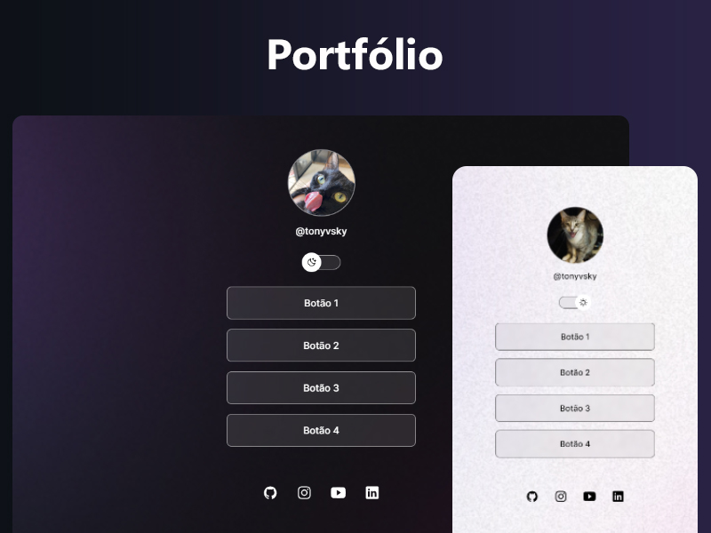

<h1 align="center">Página para Portfólio</h1>

Exemplo de portfólio com botões para links úteis e mídias sociais.

    

<h2>:computer: Tecnologias</h2>

Esse projeto foi desenvolvido com as seguintes tecnologias:

- HTML e CSS

- JavaScript

- Git e Github

  
<h2>:rocket: Crédito</h2>

Projeto feito com base nas aulas da Rocketseat :heart:
